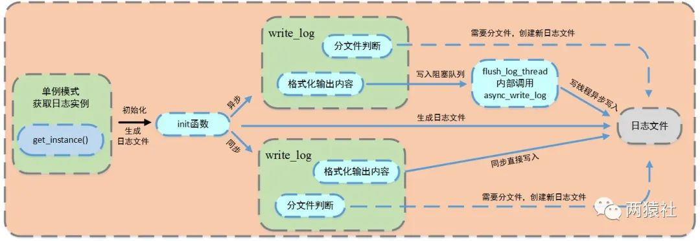

# 同步/异步日志系统的实现

## 基础知识

日志，由服务器自动创建，并记录运行状态，错误信息，访问数据的文件。

同步日志，日志写入函数与工作线程串行执行，由于涉及到I/O操作，当单条日志比较大的时候，同步模式会阻塞整个处理流程，服务器所能处理的并发能力将有所下降，尤其是在峰值的时候，写日志可能成为系统的瓶颈。

生产者-消费者模型，并发编程中的经典模型。以多线程为例，为了实现线程间数据同步，生产者线程与消费者线程共享一个缓冲区，其中生产者线程往缓冲区中push消息，消费者线程从缓冲区中pop消息。

阻塞队列，将生产者-消费者模型进行封装，使用循环数组实现队列，作为两者共享的缓冲区。

异步日志，将所写的日志内容先存入阻塞队列，写线程从阻塞队列中取出内容，写入日志。

单例模式，最简单也是被问到最多的设计模式之一，保证一个类只创建一个实例，同时提供全局访问的方法。

## 整体概述

本项目中，使用单例模式创建日志系统，对服务器运行状态、错误信息和访问数据进行记录，该系统可以实现按天分类，超行分类功能，可以根据实际情况分别使用同步和异步写入两种方式。

其中异步写入方式，将生产者-消费者模型封装为阻塞队列，创建一个写线程，工作线程将要写的内容push进队列，写线程从队列中取出内容，写入日志文件。

日志系统大致可以分成两部分，其一是单例模式与阻塞队列的定义，其二是日志类的定义与使用。

## 第一部分

单例模式，描述懒汉与饿汉两种单例模式，并结合线程安全进行讨论。

生产者-消费者模型，描述条件变量，基于该同步机制实现简单的生产者-消费者模型。

代码实现，结合代码对阻塞队列的设计进行详解。

## 单例模式

保证**一个类仅有一个实例**，并提供一个访问它的全局访问点，该实例被所有程序模块共享。

- 实现思路： **私有化它的构造函数**，以防止外界创建单例类的对象；使用类的**私有静态指针**变量指向类的唯一实例，并用一个公有的静态方法获取该实例。

（私有：只用类成员才可以访问； 静态：只有一个实例）

- 实现方法：

1. 懒汉模式（不用的时候不去初始化，所以在第一次被使用时才进行初始化）

     a. 经典的线程安全懒汉模式 - 使用双检测锁模式

     ```
    pthread_mutex_t single::lock;
    
    single* single::p = NULL;
    single* single::getinstance(){
        if (NULL == p){
            pthread_mutex_lock(&lock);
            if (NULL == p){
                p = new single;
            }
            pthread_mutex_unlock(&lock);
        }
        return p;
    }
     ```

    为什么要用双检测，只检测一次不行吗？

    如果只检测一次，在每次调用获取实例的方法时，都需要加锁。
    
    双层检测可以有效避免这种情况，仅在第一次创建单例的时候加锁。

    b. 局部静态变量之线程安全懒汉模式

    ```
    single* single::getinstance(){
        static single obj;
        return &obj;
    }
    ```

    c++11后， 要求编译器保证内部静态变量的线程安全性， 所以不用人工加锁了

2. 饿汉模式（即迫不及待，在程序运行时立即初始化）

    饿汉模式**不需要用锁**，就可以实现线程安全。原因在于，在**程序运行时就定义了对象**，并对其初始化。

    存在隐藏的问题：不同编译单元，如果在初始化完成之前调用 getInstance() 方法会返回一个未定义的实例。

## 条件变量与生产者-消费者模型

### 条件变量API与陷阱

条件变量提供了一种**线程间的通知机制**， 当某个共享数据达到某个值时,唤醒等待这个共享数据的线程。

**基础API**

- pthread_cond_init函数，用于初始化条件变量

- pthread_cond_destory函数，销毁条件变量

- pthread_cond_broadcast函数，以广播的方式唤醒所有等待目标条件变量的线程

- pthread_cond_wait函数，用于等待目标条件变量。该函数调用时需要传入mutex参数(加锁的互斥锁) ，函数执行时，先把**调用线程放入条件变量的请求队列**，然后将互斥锁mutex解锁，当函数成功返回为0时，表示重新抢到了互斥锁，互斥锁会再次被锁上， 也就是说函数**内部会有一次解锁和加锁操作.**

    使用pthread_cond_wait方式如下：

    ```
    pthread _mutex_lock(&mutex)

    while(线程执行的条件是否成立){
        pthread_cond_wait(&cond, &mutex);
    }

    pthread_mutex_unlock(&mutex);
    ```

    pthread_cond_wait执行后的内部操作分为以下几步：

    - 将线程放在条件变量的请求队列后，内部解锁
    - 线程等待被pthread_cond_broadcast信号唤醒或者pthread_cond_signal信号唤醒，唤醒后去竞争锁
    - 若竞争到互斥锁，内部再次加锁

**陷阱一**

使用前要加锁，为什么要加锁？

**多线程访问**，为了避免资源竞争，所以要加锁，**使得每个线程互斥的访问公有资源。**

pthread_cond_wait内部为什么要解锁？

**如果他不解锁，那么其他线程将会无法访问公有资源。**

为什么要把调用线程放入条件变量的请求队列后再解锁？

线程是并发执行的，如果在把调用线程A放在等待队列之前，就释放了互斥锁，这就意味着**其他线程**比如线程B可以获得互斥锁去访问公有资源，这时候线程A所等待的条件改变了，但是它没有被放在等待队列上，导致A忽略了等待条件被满足的信号。

倘若在线程A调用pthread_cond_wait开始，到把A放在等待队列的过程中，都持有互斥锁，其他线程无法得到互斥锁，就不能改变公有资源。

为什么最后还要加锁？

将线程放在条件变量的请求队列后，将其解锁，此时等待被唤醒，若**成功竞争**到互斥锁，再次加锁。

**陷阱二**

为什么判断线程执行的条件用while而不是if？

在wait成功之后，资源就一定可以被使用么？答案是否定的，如果同时有两个或者两个以上的线程正在等待此资源，wait返回后，资源可能已经被使用了。

## 生产者-消费者模型

生产者和消费者是互斥关系，两者对缓冲区访问互斥，同时生产者和消费者又是一个相互协作与同步的关系，只有生产者生产之后，消费者才能消费。

## 阻塞队列代码分析

阻塞队列类中封装了生产者-消费者模型，其中push成员是生产者，pop成员是消费者。

使用了循环数组实现了队列，作为两者共享缓冲区，当然了，队列也可以使用STL中的queue。

**自定义队列**

当队列为空时，从队列中获取元素的线程将会被挂起；当队列是满时，往队列里添加元素的线程将会挂起。

```
class block_queue{
public:

    // 初始化私有成员
    block_queue(int max_size = 1000)
    {
        if (max_size <= 0){
            exit(-1);
        }

        // 构造函数创建循环数组
        m_max_size = max_size;
        m_array = new T[max_size];
        m_size = 0;
        m_front = -1;
        m_back = -1;

        //创建互斥锁和条件变量
        m_mutex = new pthread_mutex_t;
        m_cond = new pthread_cond_t;
        pthread_mutex_init(m_mutex, NULL);
        pthread_cond_init(m_cond, NULL);

    }

    //往队列添加元素，需要将所有使用队列的线程先唤醒
    //当有元素push进队列，相当于生产者生产了一个元素
    //若当前没有线程等待条件变量,则唤醒无意义
    bool push(const T &item){
        pthread_mutex_lock(m_mutex);

        if (m_size >= m_max_size)
        {
            pthread_cond_broadcast(m_cond);
            pthread_mutex_unlock(m_mutex);
            return false;
        }

        //将新增数据放在循环数组的对应位置
        m_back = (m_back + 1) % m_max_size;
        m_array[m_back] = item;
        m_size++;

        pthread_cond_broadcast(m_cond);
        pthread_mutex_unlock(m_mutex);

        return true;
    }

    //pop时，如果当前队列没有元素,将会等待条件变量
    bool pop(T &item){
        pthread_mutex_lock(m_mutex);

        //多个消费者的时候，这里要是用while而不是if
        while (m_size <= 0){
            //当重新抢到互斥锁，pthread_cond_wait返回为0
            if (0 != pthread_cond_wait(m_cond, m_mutex)){
                // 发生内部错误
                pthread_mutex_unlock(m_mutex);
                return false;
            }
        }

        //取出队列首的元素，这里需要理解一下，使用循环数组模拟的队列 
        m_front = (m_front + 1) % m_max_size;
        item = m_array[m_front];
        m_size--;

        pthread_mutex_unlock(m_mutex);
        return true;
    }

    //增加了超时处理，在项目中没有使用到
    //在pthread_cond_wait基础上增加了等待的时间，只指定时间内能抢到互斥锁即可
    //其他逻辑不变
    bool pop(T &item, int ms_timeout){
        struct timespec t = {0, 0};
        struct timeval now = {0, 0};
        gettimeofday(&now, NULL);
        pthread_mutex_lock(m_mutex);
        if (m_size <= 0){
            t.tv_sec = now.tv_sec + ms_timeout / 1000;
            t.tv_nsec = (ms_timeout % 1000) * 1000;
            if (0 != pthread_cond_timedwait(m_cond, m_mutex, &t))
            {
                if (0 != pthread_cond_timedwait(m_cond, m_mutex, &t)){
                    pthread_mutex_unlock(m_mutex);
                     return false;
                }
            }
        }

        if (m_size <= 0){
            pthread_mutex_unlock(m_mutex);
            return false;
        }

        m_front = (m_front + 1) % m_max_size;
        item = m_array[m_front];
        m_size--;
        pthread_mutex_unlock(m_mutex);
        return true;
    }

};
```


----

## 第二部分

基础API，描述fputs，可变参数宏__VA_ARGS__，fflush

流程图与日志类定义，描述日志系统整体运行流程，介绍日志类的具体定义

功能实现，结合代码分析同步、异步写文件逻辑，分析超行、按天分文件和日志分级的具体实现

## 基础API

**fputs**

```
#include <stdio.h>
int fputs(const char *str, FILE *stream);
```

- str，一个数组，包含了要写入的以空字符终止的字符序列。

- stream，指向FILE对象的指针，该FILE对象标识了要被写入字符串的流。


**可变参数宏__VA_ARGS__**

__VA_ARGS__是一个可变参数的宏，定义时宏定义中参数列表的最后一个参数为省略号，在实际使用时会发现有时会加##，有时又不加。

```
//最简单的定义
#define my_print1(...)  printf(__VA_ARGS__)

//搭配va_list的format使用
#define my_print2(format, ...) printf(format, __VA_ARGS__)  
#define my_print2(format, ...) printf(format, __VA_ARGS__)  

__VA_ARGS__宏前面加上##的作用在于，当可变参数的个数为0时，这里printf参数列表中的的##会把前面多余的","去掉，否则会编译出错，建议使用后面这种，使得程序更加健壮。

```

**fflush**

```
#include <stdio.h>
int fflush(FILE *stream);
```

fflush()会强迫将缓冲区内的数据写回参数stream 指定的文件中，如果参数stream 为NULL，fflush()会将所有打开的文件数据更新。

在使用多个输出函数连续进行多次输出到控制台时，有可能下一个数据再上一个数据还没输出完毕，还在输出缓冲区中时，下一个printf就把另一个数据加入输出缓冲区，结果冲掉了原来的数据，出现输出错误。

在prinf()后加上fflush(stdout); 强制马上输出到控制台，可以避免出现上述错误。

## 流程图与日志类定义

**流程图**

- 日志文件

    - 局部变量的懒汉模式获取实例
    - 生成日志文件，并判断同步和异步写入方式

- 同步
    - 判断是否分文件
    - 直接格式化输出内容，将信息写入日志文件

- 异步

    - 判断是否分文件
    - 格式化输出内容，将内容写入阻塞队列，创建一个写线程，从阻塞队列取出内容写入日志文件



**日志类定义**

通过局部变量的懒汉单例模式创建日志实例，对其进行初始化生成日志文件后，格式化输出内容，并根据不同的写入方式，完成对应逻辑，写入日志文件。

日志类包括但不限于如下方法，

- 公有的实例获取方法
- 初始化日志文件方法
- 异步日志写入方法，内部调用私有异步方法
- 内容格式化方法
- 刷新缓冲区
- ...

```
class Log
{
public:
    //C++11以后,使用局部变量懒汉不用加锁
    static Log *get_instance()
    {
        static Log instance;
        return &instance;
    }

    static void *flush_log_thread(void *args)
    {
        Log::get_instance()->async_write_log();
    }
    //可选择的参数有日志文件、日志缓冲区大小、最大行数以及最长日志条队列
    bool init(const char *file_name, int close_log, int log_buf_size = 8192, int split_lines = 5000000, int max_queue_size = 0);

    void write_log(int level, const char *format, ...);

    void flush(void);

private:
    Log();
    virtual ~Log();
    void *async_write_log()
    {
        string single_log;
        //从阻塞队列中取出一个日志string，写入文件
        while (m_log_queue->pop(single_log))
        {
            m_mutex.lock();
            fputs(single_log.c_str(), m_fp);
            m_mutex.unlock();
        }
    }

private:
    char dir_name[128]; //路径名
    char log_name[128]; //log文件名
    int m_split_lines;  //日志最大行数
    int m_log_buf_size; //日志缓冲区大小
    long long m_count;  //日志行数记录
    int m_today;        //因为按天分类,记录当前时间是那一天
    FILE *m_fp;         //打开log的文件指针
    char *m_buf;
    block_queue<string> *m_log_queue; //阻塞队列
    bool m_is_async;                  //是否同步标志位
    locker m_mutex;
    int m_close_log; //关闭日志
};

#define LOG_DEBUG(format, ...) if(0 == m_close_log) {Log::get_instance()->write_log(0, format, ##__VA_ARGS__); Log::get_instance()->flush();}
#define LOG_INFO(format, ...) if(0 == m_close_log) {Log::get_instance()->write_log(1, format, ##__VA_ARGS__); Log::get_instance()->flush();}
#define LOG_WARN(format, ...) if(0 == m_close_log) {Log::get_instance()->write_log(2, format, ##__VA_ARGS__); Log::get_instance()->flush();}
#define LOG_ERROR(format, ...) if(0 == m_close_log) {Log::get_instance()->write_log(3, format, ##__VA_ARGS__); Log::get_instance()->flush();}

```

日志类中的方法都不会被其他程序直接调用，末尾的四个可变参数宏提供了其他程序的调用方法。

前述方法对日志等级进行分类，包括DEBUG，INFO，WARN和ERROR四种级别的日志。

## 功能实现

init函数实现日志创建、写入方式的判断。

write_log函数完成写入日志文件中的具体内容，主要实现日志分级、分文件、格式化输出内容。

**生成日志文件 && 判断写入方式**

通过单例模式获取唯一的日志类，调用init方法，初始化生成日志文件，服务器启动按当前时刻创建日志，前缀为时间，后缀为自定义log文件名，并记录创建日志的时间day和行数count。

写入方式通过初始化时是否设置队列大小（表示在队列中可以放几条数据）来判断，若队列大小为0，则为同步，否则为异步。

```
//异步需要设置阻塞队列的长度，同步不需要设置
bool Log::init(const char *file_name, int close_log, int log_buf_size, int split_lines, int max_queue_size)
{
    //如果设置了max_queue_size,则设置为异步
    if (max_queue_size >= 1)
    {
        m_is_async = true;
        m_log_queue = new block_queue<string>(max_queue_size);
        pthread_t tid;
        //flush_log_thread为回调函数,这里表示创建线程异步写日志
        pthread_create(&tid, NULL, flush_log_thread, NULL);
    }
    
    m_close_log = close_log;
    m_log_buf_size = log_buf_size;
    m_buf = new char[m_log_buf_size];
    memset(m_buf, '\0', m_log_buf_size);
    m_split_lines = split_lines;

    time_t t = time(NULL);
    struct tm *sys_tm = localtime(&t);
    struct tm my_tm = *sys_tm;

 
    const char *p = strrchr(file_name, '/');
    char log_full_name[256] = {0};

    if (p == NULL)
    {
        snprintf(log_full_name, 255, "%d_%02d_%02d_%s", my_tm.tm_year + 1900, my_tm.tm_mon + 1, my_tm.tm_mday, file_name);
    }
    else
    {
        strcpy(log_name, p + 1);
        strncpy(dir_name, file_name, p - file_name + 1);
        snprintf(log_full_name, 255, "%s%d_%02d_%02d_%s", dir_name, my_tm.tm_year + 1900, my_tm.tm_mon + 1, my_tm.tm_mday, log_name);
    }

    m_today = my_tm.tm_mday;
    
    m_fp = fopen(log_full_name, "a");
    if (m_fp == NULL)
    {
        return false;
    }

    return true;
}
```

**日志分级与分文件**

日志分级的实现大同小异，一般的会提供五种级别，具体的，

    Debug，调试代码时的输出，在系统实际运行时，一般不使用。

    Warn，这种警告与调试时终端的warning类似，同样是调试代码时使用。

    Info，报告系统当前的状态，当前执行的流程或接收的信息等。

    Error和Fatal，输出系统的错误信息。

上述的使用方法仅仅是个人理解，在开发中具体如何选择等级因人而异。项目中给出了除Fatal外的四种分级，实际使用了Debug，Info和Error三种。

超行、按天分文件逻辑，具体的，

    日志写入前会判断当前day是否为创建日志的时间，行数是否超过最大行限制

        若为创建日志时间，写入日志，否则按当前时间创建新log，更新创建时间和行数

        若行数超过最大行限制，在当前日志的末尾加count/max_lines为后缀创建新log

将系统信息格式化后输出，具体为：格式化时间 + 格式化内容

```
void Log::write_log(int level, const char *format, ...)
{
    struct timeval now = {0, 0};
    gettimeofday(&now, NULL);
    time_t t = now.tv_sec;
    struct tm *sys_tm = localtime(&t);
    struct tm my_tm = *sys_tm;
    char s[16] = {0};
    switch (level)
    {
    case 0:
        strcpy(s, "[debug]:");
        break;
    case 1:
        strcpy(s, "[info]:");
        break;
    case 2:
        strcpy(s, "[warn]:");
        break;
    case 3:
        strcpy(s, "[erro]:");
        break;
    default:
        strcpy(s, "[info]:");
        break;
    }
    //写入一个log，对m_count++, m_split_lines最大行数
    m_mutex.lock();
    m_count++;

    if (m_today != my_tm.tm_mday || m_count % m_split_lines == 0) //everyday log
    {
        
        char new_log[256] = {0};
        fflush(m_fp);
        fclose(m_fp);
        char tail[16] = {0};
       
        snprintf(tail, 16, "%d_%02d_%02d_", my_tm.tm_year + 1900, my_tm.tm_mon + 1, my_tm.tm_mday);
       
        if (m_today != my_tm.tm_mday)
        {
            snprintf(new_log, 255, "%s%s%s", dir_name, tail, log_name);
            m_today = my_tm.tm_mday;
            m_count = 0;
        }
        else
        {
            snprintf(new_log, 255, "%s%s%s.%lld", dir_name, tail, log_name, m_count / m_split_lines);
        }
        m_fp = fopen(new_log, "a");
    }
 
    m_mutex.unlock();

    va_list valst;
    va_start(valst, format);

    string log_str;
    m_mutex.lock();

    //写入的具体时间内容格式
    int n = snprintf(m_buf, 48, "%d-%02d-%02d %02d:%02d:%02d.%06ld %s ",
                     my_tm.tm_year + 1900, my_tm.tm_mon + 1, my_tm.tm_mday,
                     my_tm.tm_hour, my_tm.tm_min, my_tm.tm_sec, now.tv_usec, s);
    
    int m = vsnprintf(m_buf + n, m_log_buf_size - n - 1, format, valst);
    m_buf[n + m] = '\n';
    m_buf[n + m + 1] = '\0';
    log_str = m_buf;

    m_mutex.unlock();

    if (m_is_async && !m_log_queue->full())
    {
        m_log_queue->push(log_str);
    }
    else
    {
        m_mutex.lock();
        fputs(log_str.c_str(), m_fp);
        m_mutex.unlock();
    }

    va_end(valst);
}
```


