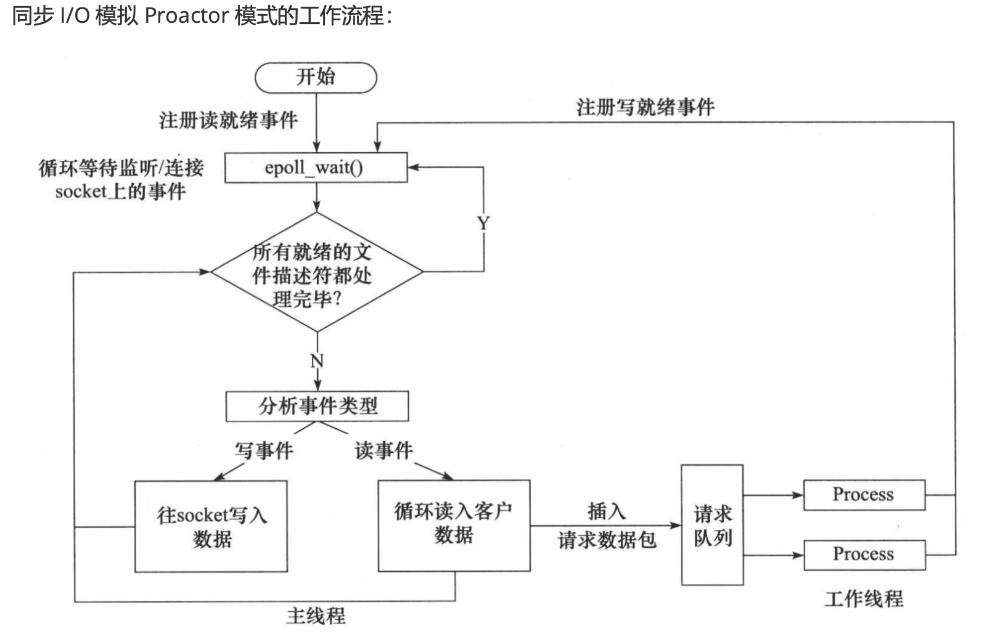

# WebServer

## 目录

[1. 服务器的部署](#1)

[2. 技术介绍](#2)

[2.1 线程池 + 非阻塞socket + epoll + 模拟Proactor事务处理模型](#2-1)

[2.2 使 用正则表达式 和有限状态机 解 析GET 和POST 请 求](#2-2)

[2.3 访问服务器数据库实现web端用户注册、登录功能，可以请求服务器图片和视频文件](#2-3)

[2.4 使用基于升序链表的定时器处理非活动连接](#2-4)

[2.5 实现同步/异步日志系统，记录服务器运行状态](#2-5)

[2.6 经Webbench压力测试可以实现上万的并发连接数据交换](#2-6)

[](#)

## <a id="1">1 服务器部署</a>

1、测试前确认已安装MySQL数据库 并 创建对应的数据库、表

安装

```
Ubuntu系统：
// 安装 MySQL 服务器：
sudo apt-get update
sudo apt-get install mysql-server

// 启动 MySQL 服务器：
sudo systemctl start mysql
若要确保 MySQL 在系统启动时自动启动，可以运行以下命令：
sudo systemctl enable mysql

// 安装 MySQL C/C++ 客户端库：
sudo apt-get install libmysqlclient-dev
```

创建

```
create database gjh_webserver;

use gjh_webserver;

create table user(name varchar(50), passwd varchar(50));

insert into user(name, passwd) values("gjh", "gjh");

select * from user;

exit;
```

2、编译

**手动编译时，要添加“-lmysqlclient”选项链接mysql数据库**

**手动编译时，要添加“-pthread”选项链接线程库**

`g++ *.cpp -pthread -lmysqlclient`

3、启动服务器

指定服务器程序端口号：10000

`./a.out 10000`

4、访问服务器

浏览器输入（实现不同功能）(aliyun: 8.130.75.139)：

    登陆页面：
    http://xxx.xxx.xxx.xxx:10000/1

5、性能测试

`./webbench -c 100 -t 10 http://8.130.75.139:10000/1`

## <a id="2">2 技术介绍</a>

### <a id="2-1">2.1 线程池 + 非阻塞socket + epoll + 模拟Proactor事务处理模型</a>

**1、 线程池**

模拟Proactor模式下进程和线程各自的职责：

    服务器程序相当于一个进程，在程序启动时就创建拥有指定数量的线程构成线程池

    进程都做哪些工作：

    1. 服务器的运行 
    2. 监听事件、分析事件
        1. 管理用户（用户的初始化、读取用户数据的到达、向用户写缓冲区中写数据）
        2. 管理定义器、定义器管道的读写
    3. 日志系统管理
    3. 数据库相关

    线程都做哪些工作：

    1. 解析用户到达的数据，分析请求，注册写事件

**2、非阻塞socket**

    当检测某个文件描述符是否有时间发生时：阻塞模式下则一直阻塞，直到有事件发生；非阻塞模式为直接返回是否发生事件，一般如果发生返回fd，如果不发生返回0。

**3、epoll**

非阻塞、忙轮巡

一种I/O多路复用技术，可以同时监听多个I/O事件（文件描述符）的发生。

文件描述符会发生事件：

1. 新用户建立连接 
2. 用户内部错误 
3. 定时器相关 
4. 客户端发送数据 
5. 有写事件发生

针对每种事件，都会有对应的具体的操作

具体的原理：

    总而言之，委托内核对所有的待监听事件（红黑树存储）进行扫描，如果某个文件描述符有事件发生，加入到双链表中，epoll_wait()调用会从双链表中去发生事件的描述符进行处理。

**4、模拟Proactor事务处理模型**

读就绪：你要读文件了

写就绪：你要写文件了

线程负责对每个用户到达的数据（分析请求）进行处理，其他的都是由主进程负责



### <a id='2-2'>2.2 使用正则表达式和有限状态机解析GET和POST请求</a>

用到状态机的地方：

1. 解析请求时：

    a. 主状态机 判断当前解析的部位：CHECK_STATE m_check_stats = enum CHECK_STATE { CHECK_STATE_REQUESTLINE = 0, CHECK_STATE_HEADER, CHECK_STATE_CONTENT };

    b. 从状态机，判断当前读取的状态：enum LINE_STATUS { LINE_OK = 0, LINE_BAD, LINE_OPEN };

2. 请求方法的标记

3. 请求结果的标记

具体解析“每一行”的内容时，会用到字符串匹配之类的方法，但是也可用正则表达式！！！

### <a id='2-3'>2.3 访问服务器数据库实现web端用户注册、登录功能，可以请求服务器图片和视频文件</a>

实现过程：

1. 创建数据库连接池实例 （单例模式）
2. 初始化连接池，建立MaxConn数量的数据库连接对象并将他们加入到数据库连接池，每个对象都可以独立处理数据库相关任务，并通过信号量记录可用连接数量
3. 从连接池中去一个连接，并执行查询，将结果存放到map<string, string> users;中（全局变量）
4. 
    对于登陆：

        将提交信息与数组map<string, string> users存储的信息比较后，跳转对应的页面

    对于注册：

        先看用户名是否有重复，再存储到map<string, string> users中与执行数据库语句插入到数据库中，然后跳转welcome页面

### <a id='2-4'>2.4 使用基于升序链表的定时器处理非活动连接</a>

采用升序链表存储每个用户的连接

采用管道来存储超时信号（每隔几秒会出发超时警告信号）

超时处理操作在epoll_wait（）执行完成之后在执行，先处理高优先级的事件

### <a id='2-5'>2.5 实现同步/异步日志系统，记录服务器运行状态</a>

同步：

    出现日志就停下，写日志，缺点是会影响服务器的性能

异步：

    先将发生的日志存放到阻塞队列，让日志线程异步的去写文件

### <a id='2-6'>2.6 经Webbench压力测试可以实现上万的并发连接数据交换</a>

cd /root/gjh_webserver/test_presure/webbench-1.5

webbench -c 用户数量 -t 持续时间 访问的url

### <a id=''></a>


### 简历上的所有功能已经实现

1. 还需要完善github
2. 梳理每个功能的流程，行程笔记和流程图
3. 重构代码
4. 使用cmake自动构建代码


